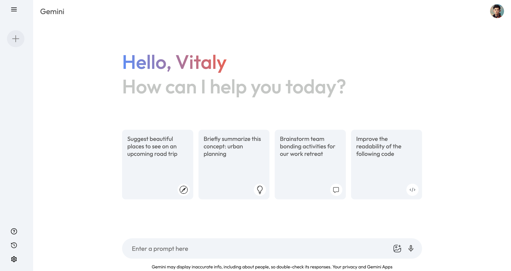

   
      
   

  

    
    
    
    
  

  <h3 align="center">A Gemini AI Clone</h3>

## 📋 <a name="table">Table of Contents</a>

1. 🤖 [Introduction](#introduction)
2. ⚙️ [Tech Stack](#tech-stack)
3. 🔋 [Features](#features)
4. 💡 [AI Integration](#ai)

## <a name="introduction">🤖 Introduction</a>

A web application replicating the functionality of Gemini AI, designed to enhance productivity through task automation with the help of an AI model. The app allows users to interact with generative AI to receive task suggestions, summarizations, brainstorming ideas, and code improvements.

## <a name="tech-stack">⚙️ Tech Stack</a>

- React
- CSS (Styled Components)
- Node.js
- Google Generative AI API

## <a name="features">🔋 Features</a>

👉**Task Automation**: Automate various tasks using an advanced AI model.

👉**User-Friendly Interface**: An intuitive and interactive UI for seamless interaction.

👉**Recent Prompts**: Save and access previous prompts for easy reuse and efficient task handling.

👉**Real-Time Responses**: Get immediate feedback and suggestions from the AI model.

👉**Customizable Inputs**: Tailor prompts according to the user’s specific needs for personalized outputs.

and many more

## <a name="#ai">💡 AI Integration</a>

The AI uses Google Generative AI (Gemini 1.5) for task automation, and real-time response generation, with safety settings to avoid harmful content.

👉**Usage**:

1) Enter prompts in the search box (e.g., “Summarize urban planning” or “Suggest places for a road trip”).

2) View results in real-time as the AI processes and returns feedback.

3) Reuse recent prompts from the sidebar for quick task handling.

4) Creating New Chats - click the "New Chat" button in the sidebar to start a fresh conversation with the AI.

👉**API Usage**

1) Configures response settings such as temperature, topK, topP, and output token limits.

2) Implements safety measures to block harmful content categories like harassment, hate speech, sexually explicit, and dangerous content.

3) Manages chat sessions and generates responses based on user input.
